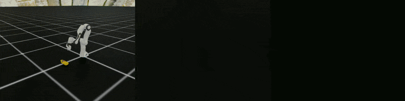
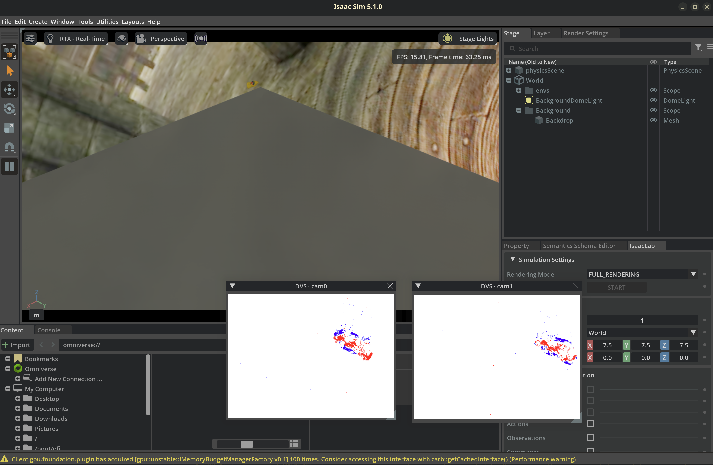

<div align="center">
  <h1>Isaac Sim Event Camera Plugin</h1>
  <p><strong>High rate event camera data simulation in <a href="https://developer.nvidia.com/isaac/sim?size=n_6_n&sort-field=featured&sort-direction=desc">Isaac Sim</a>, accelerated by motion-vector frame interpolation.</strong></p>
  <p>
    <a href="LICENSE"></a>&nbsp;
    <a href="https://www.python.org/"></a>&nbsp;
    <a href="https://isaac-sim.github.io/IsaacLab/"></a>
  </p>
</div>


## 📖 Overview
<div align="center">
  <figure>
    
    <figcaption>Wrist-camera on a Franka</figcaption>
  </figure>
  <figure align="center">
    
    <figcaption>Robot Dog Walking</figcaption> 
  </figure>
  <figure align="center">
    
    <figcaption>Object drop (stereo)</figcaption> 
  </figure>
</div>

This extension saves rendering cost by rendering sparse keyframes and warping the frames in between using motion vector, so the event camera still gets high-rate input with far fewer render calls.

```
 sim @render_hz ──▶ rgb + motion-vectors + depth keyframes
                      │  bidirectional motion-vector warp
                      ▼
 synthesised frames @render_hz×warp ──▶ event-camera model ──▶ events (HDF5)
```

## 🚀 Quickstart

> `python` means the Isaac Sim Python. If you don't use a virtual python environment, replace `python` with `${ISAACLAB}/isaaclab.sh -p` in every command below.

```bash
$ python -m pip install -e .        # add --no-deps so Isaac's own numpy/torch are left untouched
```

One command — drop an object, render at 125 Hz, warp to 1000 Hz, emit events, and write RGB + event videos to `/tmp/dvs_quickstart`:

```bash
$ python examples/quickstart.py --margin 20 --enable_cameras --kit_args "--ext-folder $PWD/extension --enable dvs_preview"
```

### Example: migrate an RGB camera to an event camera

Swap the camera cfg, render at a low keyframe rate, and warp each gap up to the event rate in your loop. Your camera placement / robot setup don't change.

```python
# 1. In your scene cfg: swap CameraCfg → DVSCameraCfg (same args; it adds the
#    rgb + motion_vectors + depth annotators the warp needs).
from dvs_gen.sensors import DVSCameraCfg
my_cam = DVSCameraCfg(
    prim_path="{ENV_REGEX_NS}/Robot/head/cam", height=480, width=640, threshold=0.15,
    spawn=..., offset=...,        # ← keep whatever your CameraCfg already had
)

# 2. Render at a low KEYFRAME rate; the warp multiplies it K× (events at render_hz × K).
RENDER_HZ, K = 50, 8                       # render 50 Hz, warp 8× → 400 Hz events
DT_FINE = 1.0 / (RENDER_HZ * K)
cfg.sim.dt = 1.0 / RENDER_HZ              # one physics step = one keyframe render
cfg.sim.render_interval = 1

# 3. After `env = ManagerBasedRLEnv(cfg=cfg)`: wrap the camera and warp each gap into events.
from dvs_gen.sensors import DVSCamera
dvs = DVSCamera.from_scene(env.scene, ["my_cam"], out_dir="/tmp/dvs")

env.step(action); prev = dvs.snapshot(); t_prev = float(env.sim.current_time)
while running:
    env.step(action)                                          # one low-rate keyframe
    cur = dvs.snapshot()
    dvs.warp_and_process(prev, cur, K, t_prev, DT_FINE)        # K frames per gap → events at render_hz × K
    prev, t_prev = cur, float(env.sim.current_time)
    if reset:
        dvs.reset(reset_ids); dvs.flush(env_id, episode_idx)  # re-seed reference, save env{e}_ep{ep}.h5
        env.step(action); prev = dvs.snapshot(); t_prev = float(env.sim.current_time)
```

This is the accelerated path: render 50 Hz, events at 400 (50x8) Hz. The full runnable version (stereo, episodes, annotations, RGB video) is `scripts/simulate_warp.py`. For plain render-rate events without warp, set `enable_warp=False` on the cfg and call `dvs.process(t)` each step instead.

## 📚 Library API

```python
from dvs_gen import DVSCamera, DVSCameraCfg, DVSEnvCfg     # Isaac-side
from dvs_gen import GeneralDVSRecorder, BatchedMultiCamProcessor, bidir_warp_gap  # pure core
```

- **`DVSCameraCfg`** — drop-in `CameraCfg` preset that auto-requests the annotators the event-camera pipeline needs (`rgb`, `motion_vectors`, `depth`) and carries the contrast `threshold`.
- **`DVSCamera`** — runtime bundle of the stereo cameras + per-camera event processors + recorder. `from_scene(...)`, `snapshot()`, `warp_and_process(...)`, `process(...)`, `reset(...)`, `flush(...)`. The warp batches **all cameras and all envs into a single** `bidir_warp_gap` call.
- **`DVSEnvCfg`** — a clean, minimal, runnable env (one stereo pair, one dropped YCB object, randomized dome). Copy it and change one thing at a time.

## Live event preview in the GUI



Headless is the usual path, but you can also watch the events **live** while Isaac Lab runs in **GUI** mode. Handy when you mount an event camera on a robot and just want to see it working.

**Quick try with `simulate_warp.py`.** The bundled showcase already tags its stereo cameras, so just run it from the repo root in GUI mode (no `--headless`) and point the kit args at the `extension/` folder — two windows `cam0` and `cam1` pop up and show live events as the object falls:

```bash
python scripts/simulate_warp.py --num_envs 1 --render_hz 50 --warp 8 \
    --max_episodes 99 --enable_cameras \
    --kit_args "--ext-folder $PWD/extension --enable dvs_preview"
```

- **Tag the cameras you want previewed.** Scripts that use `DVSCamera.from_scene(...)` (e.g. `simulate_warp.py`, `quickstart.py`) tag their cameras automatically. In your own scene, add a `DVSCameraCfg` and tag it once after the env is built:

```python
from dvs_gen.sensors import DVSCameraCfg, tag_dvs_cameras
import isaaclab.sim as sim_utils

# in your InteractiveSceneCfg:
dvs_cam = DVSCameraCfg(
    prim_path="{ENV_REGEX_NS}/Robot/head/dvs_cam",   # mount it wherever
    update_period=0.0, height=480, width=640, threshold=0.15,
    spawn=sim_utils.PinholeCameraCfg(clipping_range=(0.01, 1e5)),
    offset=DVSCameraCfg.OffsetCfg(pos=(0.1, 0.0, 0.05), convention="world"),
)

# after `env = ManagerBasedRLEnv(cfg=cfg)`:
tag_dvs_cameras(env.scene, ["dvs_cam"])
```

## Scripts


| Script                       | Purpose                                                      |
| ---------------------------- | ------------------------------------------------------------ |
| `examples/quickstart.py`     | minimal end-to-end demo (sim → warp → events → video)        |
| `scripts/simulate_warp.py`   | full data-gen showcase: stereo, episodes, annotations, real-time report |
| `scripts/visualize_rgb.py`   | stack the synthesised stereo RGB streams into one video      |
| `scripts/visualize_event.py` | bin recorded events into a stereo event video                |
| `scripts/process_ycb.py`     | (re)download YCB objects + add colliders → package data dir  |


Typical run:

```bash
$ python scripts/simulate_warp.py --num_envs 1 --render_hz 125 --warp 8 --max_episodes 3 --margin 50 --enable_cameras --headless
$ python scripts/visualize_event.py --dir /tmp/multi_cam_dvs --env 0 --eps 0
$ python scripts/visualize_rgb.py   --dir /tmp/multi_cam_dvs --env 0 --eps 0
```

## Package layout

```
dvs_gen/                       # repo root
├── dvs_gen/                   # importable package
│   ├── dvs/         GeneralDVSRecorder, BatchedMultiCamProcessor   (pure core)
│   ├── warp/        bidir_warp_gap + interpolation strategies      (pure torch)
│   ├── sensors/     DVSCamera, DVSCameraCfg, tag_dvs_cameras       (Isaac side)
│   ├── env/         DVSEnvCfg (default) + research config + scene/events/...
│   ├── assets/      YCB object + stereo-rig config builders
│   ├── sim_utils/   USD camera placement, calibration, background randomizer
│   ├── io/          H264Writer
│   ├── representations/   event-frame representations
│   └── data/        bundled YCB USD objects, dome textures, stereo.yaml
├── scripts/         simulate_warp · visualize_rgb/event · process_ycb
├── examples/        quickstart.py
└── extension/       dvs_preview — optional GUI live-event-preview Kit extension
```

## Output format

One HDF5 file per (env, episode): `env{e}_ep{ep}.h5`, with a group per camera (`DVS/cam0`, `DVS/cam1`) holding datasets `x` (uint16), `y` (uint16), `t` (float64 seconds), `p` (int8, +1 = ON / −1 = OFF).

## Benchmark Result

**Benchmark Setup (Single Environment, RTX 5090):**

- **Scene:** One dropped mustard bottle.
- **Timing:** All times are measured in **ms per output frame**.
- **Configuration:** `render_hz × warp multiplier + margin pixels`


| config         | render | warp | event | total     | vs real-time      |
| :------------: | :----: | :--: | :---: | :-------: | :---------------: |
| 1000 (no warp) | 13.18  | –    | 0.70 | **13.88** | 13.9× slower      |
| 250 × 4        | 4.24   | 0.94 | 0.52 | **5.70**  | 5.7× slower       |
| 250 × 4 + m50  | 4.32   | 1.06 | 0.58 | **5.96**  | 6.0× slower       |
| 125 × 8        | 2.03   | 0.73 | 0.46 | **3.22**  | 3.2× slower       |
| 125 × 8 + m50  | 2.06   | 1.07 | 0.44 | **3.57**  | 3.6× slower       |
| 40 × 8         | 2.03   | 0.74 | 0.50 | **3.27**  | 1.1× slower       |
| 40 × 8 + m50   | 1.99   | 1.08 | 0.46 | **3.53**  | 1.1× slower       |
| 30 × 8         | 2.19   | 0.73 | 0.44 | **3.36**  | **1.2× faster** ✅ |
| 30 × 8 + m50   | 2.16   | 1.09 | 0.45 | **3.70**  | **1.1× faster** ✅ |


## Assets

The bundled `data/ycb_objects/*.usd` are physics-enabled conversions of the [YCB object set](https://www.ycbbenchmarks.com/) (originally distributed via NVIDIA Isaac assets). Regenerate or extend them with `scripts/process_ycb.py`.

## License

MIT — see [LICENSE](LICENSE).

<div align="center">
  <br>
  <a href="https://github.com/spikelab-jhu">
    
  </a>
  <p><sub>Developed by <strong>SPIKE Lab</strong>, Johns Hopkins University</sub></p>
</div>
